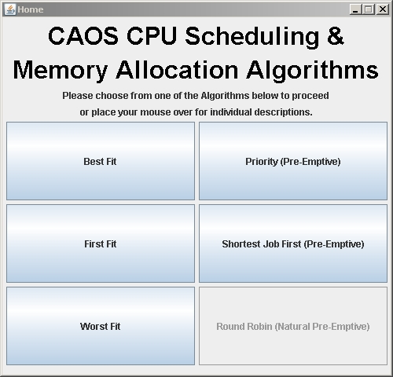
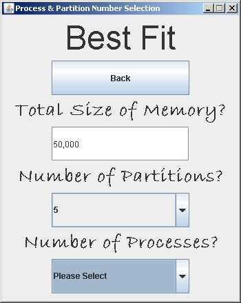
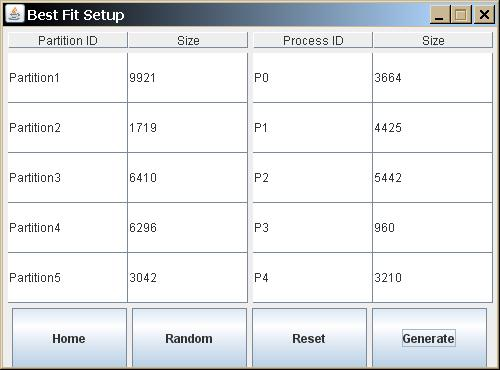
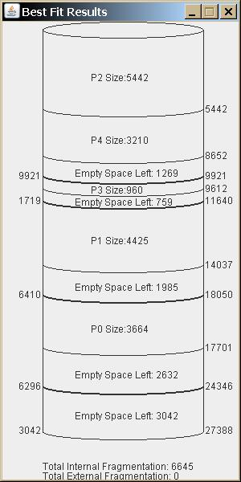
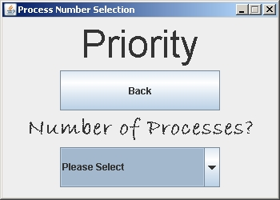
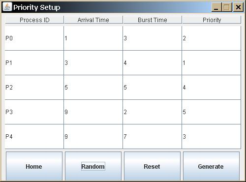
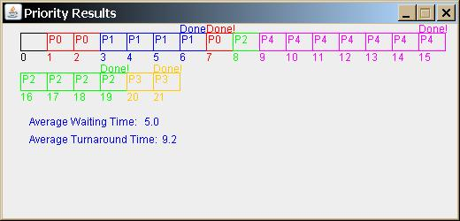

## Computer Architecture & Operating Systems (ESE3009)

Takes in user inputs, and displays results in Cylinder/Gantt Chart after running algorithms.

## Download

Download executable .jar at https://www.dropbox.com/s/0y5kvlirs70fmba/CAOS.jar. Have fun! :)

## Screenshots

